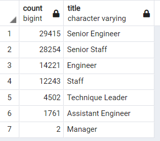
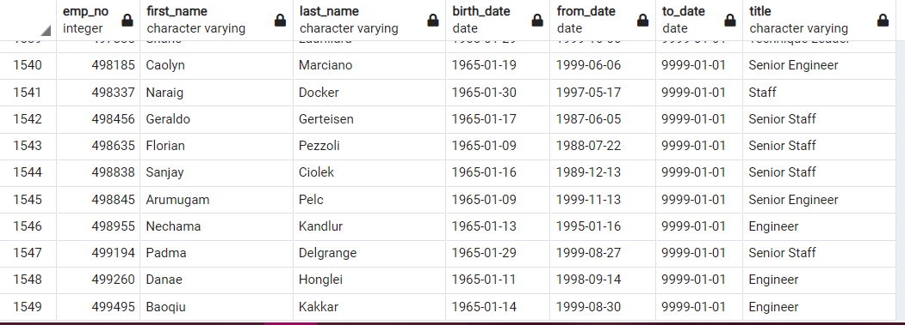

# Pewlett-Hackard-Analysis

## Overview of the analysis: 
Purpose of this analysis is to determine the number of retiring employees per title, and identify employees who are eligible to participate in a mentorship program. This analysis will help prepare Bobby’s manager and Pewlett_Hackard for the “silver tsunami” as many current employees reach retirement age.

## Results: 
- Pewlett-Hackard is about to have a "silver tsunami" as 90,398 employees reach retirement age

- The largest portion of employees retiring will be from the Engineering department, as seen in the chart above.
- 29,415 Senior Engineers are reaching retirement age. 
- With a large number of employees reaching retirement age it will be important for Pewlett-Hackard to focus on the development and mentorship of it's current employees who are not reaching retirement age. 1549 employees will be eligible for the mentorship program. 

## Summary:
### How many roles will need to be filled as the "silver tsunami" begins to make an impact?
- 90,398 employees are reaching retirement age, these roles will need to be filled as the silver tsunami begins. 

### Are there enough qualified, retirement-ready employees in the departments to mentor the next generation of Pewlett Hackard employees?
- 1549 employees will be eligible for the mentorship program. This is not enough mentors to help 90k of the next generation employees. 
